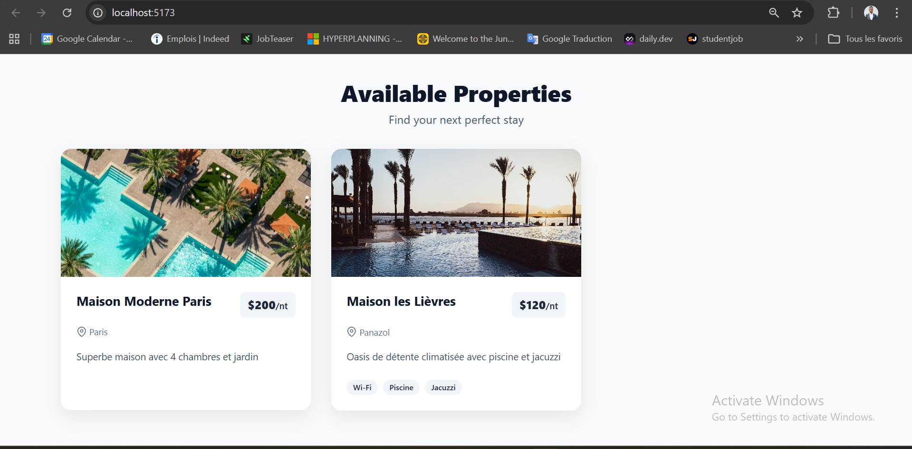
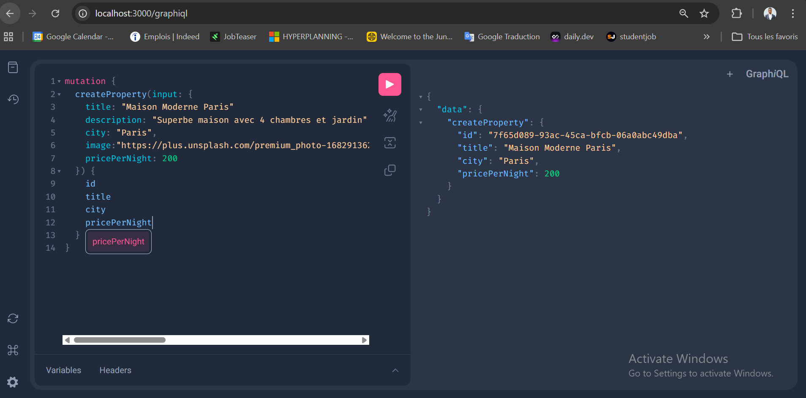

# 🏡 Demo HotenB - Plateforme Immobilière

Bienvenue sur le projet **Demo HotenB** ! Ce dépôt contient une application full-stack moderne permettant de consulter une liste de logements (propriétés immobilières).

## 💡 Ce qui a été réalisé pour cette démo

Pour cette démonstration, une architecture complète a été mise en place, séparant clairement les responsabilités entre le backend et le frontend :

1. **Le Backend (API GraphQL)** : 
   - Construit avec **Fastify** et **Mercurius** pour exposer une API GraphQL très performante.
   - Utilisation de **Prisma** comme ORM avec une base de données SQLite pour stocker les logements.
   - Mise en place d'une architecture modulaire (Services, Resolvers, Validators avec Zod) pour un code robuste.
   - Gestion des CORS pour la communication avec le frontend.

2. **Le Frontend (React)** :
   - Interface utilisateur développée avec **React** et **Vite** (TypeScript).
   - Styled avec **Tailwind CSS v3** pour un design moderne, épuré et réactif (ombres, micro-interactions).
   - Utilisation de **TanStack Query** (React Query) couplé à `graphql-request` pour récupérer les données du backend.
   - Amélioration de l'UX avec des **Skeletons de chargement** animés (au lieu d'un simple texte de chargement) et une gestion des états d'erreur ou d'absence de données.

## 📸 Aperçus du projet

### L'Interface Utilisateur (Frontend)
Voici à quoi ressemble la grille de logements côté client :



### L'Explorateur GraphQL (Backend)
GraphiQL est disponible en mode développement pour tester et explorer les requêtes :



---

## 🚀 Guide de démarrage (Quickstart)

Pour lancer le projet sur votre machine locale, vous aurez besoin de deux terminaux (un pour le backend, un pour le frontend). Assurez-vous d'avoir Node.js installé.

### 1️⃣ Lancer le Backend
Le backend contient la base de données et l'API GraphQL.
Ouvrez un terminal à la racine du projet et exécutez :

```bash
cd backend
npm install
npm run start:dev
```
*Cette commande va : installer les dépendances, mettre à jour la base de données SQLite, insérer les données de test (seed) et lancer le serveur sur `http://localhost:3000`.*
*(L'interface GraphiQL sera accessible sur `http://localhost:3000/graphiql`)*

### 2️⃣ Lancer le Frontend
Le frontend contient l'interface utilisateur React.
Ouvrez un **deuxième** terminal à la racine du projet et exécutez :

```bash
cd frontend
npm install
npm run dev
```
*Le serveur de développement Vite se lancera.*
*Cliquez sur l'URL affichée dans le terminal (généralement **`http://localhost:5173`**) pour ouvrir l'application dans votre navigateur.*

---
## 📚 En savoir plus
Pour comprendre en détail le projet et son architecture, des rapports spécifiques sont disponible :
- 👉 [Lire le README du Backend](./backend/README.md)
- 👉 [Lire le guide de démarrage du Backend](./backend/QUICKSTART.md)
- 👉 [Lire le guide de test du Backend](./backend/API_TESTING.md)
- 👉 [Lire le README du Frontend](./frontend/README.md)